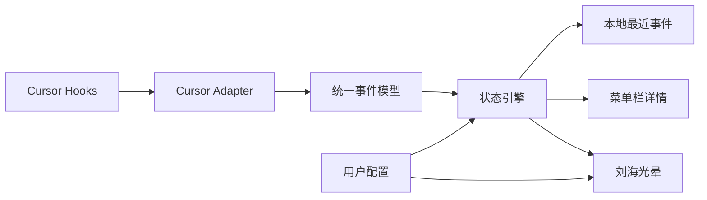

# Liang macOS 状态指示器规划

## ① 项目总则

- Liang 是 macOS 菜单栏常驻应用，用刘海周围的非侵入式光晕提示 AI IDE 工作状态。
- 第一阶段只接入 Cursor Hooks；后续通过 Adapter 扩展 Cloud Code、Codex、PI、Trae、CodeBuddy 等来源。
- 每个开发任务只交付一个用户可以亲手验证的能力；任务完成必须编译并实际运行 App，再附带小白测试脚本。
- 需求不明确或存在多种实现时，先向用户提供 A/B/C 选项和推荐，不自行扩大范围。
- 最小实现优先，不读取或上传代码、Prompt、文件内容；默认只处理状态事件和必要的本地元数据。
- 优先使用 macOS 14+ 官方 API；涉及屏幕安全区域、窗口层级和系统权限时，开发前核对 Apple 当前文档。

## ② 环境事实

- 应用名：Liang
- 建议 Bundle Identifier：`com.liang.app`，首次确定后固定，避免 TCC 和用户配置失效。
- 平台：macOS 14.0+
- 芯片：Apple Silicon 优先；第一阶段不把 Intel 作为正式兼容目标，除非后续确认需求。
- 技术栈：Swift + SwiftUI；AppKit 负责菜单栏、透明光晕窗口、屏幕几何和窗口层级。
- App 类型：菜单栏常驻，`LSUIElement = true`，默认不显示 Dock 图标和主窗口。
- 分发：第一阶段本地自用，暂不上架 App Store；是否关闭 App Sandbox 应在工程创建前再次确认。
- 数据原则：本地优先；Cursor Hook 内容不上传，配置存储在 UserDefaults 或本地配置文件。
- 默认状态颜色：空闲、处理中、等待确认、成功、警告/错误、未知；颜色和动画均可自定义。

## ③ 核心状态架构

Cursor Hooks 是事件来源，不应被当作永远可靠的权威状态。Liang 需要用事件、任务生命周期、心跳和超时合并出稳定状态。



统一事件模型至少包含：来源、事件类型、任务标识、时间戳、可选进度、可选简短描述。状态引擎必须处理重复事件、乱序事件、任务超时、Hook 丢失、Cursor 退出、系统睡眠和未知状态。

建议的状态优先级：错误/需要确认 > 执行中 > 思考中 > 成功提示 > 空闲。成功状态只展示有限时间，错误和等待确认状态保持到用户查看或状态恢复。

## ④ 刘海和窗口适配规则

- 使用 `NSScreen` 的安全区域和刘海相关区域 API 获取几何信息，不写死 14 英寸或 16 英寸坐标。
- 光晕只绘制在刘海周围的安全环带，不遮挡摄像头、菜单栏内容或其他可点击区域。
- 使用无边框、透明、非激活、默认忽略鼠标事件的 AppKit 窗口；交互详情通过菜单栏或单独详情面板完成。
- 监听显示器连接、断开、主屏切换、分辨率/缩放变化、Space 和全屏状态，及时重新布局。
- 有刘海设备显示环绕光晕；无刘海设备降级为屏幕顶部中央光晕，并始终保留菜单栏状态入口。
- 默认只显示在主屏；多屏显示、全屏显示和外接屏策略作为明确设置项，不在 MVP 中隐式猜测。

## ⑤ 用户配置

MVP 配置范围：

- 光晕启用/禁用
- 亮度
- 模糊半径
- 光晕厚度
- 呼吸开关
- 动画速度
- 各状态颜色
- 是否显示成功状态
- 低功耗模式
- 遵循 macOS“减少动态效果”
- Cursor Hook 来源启用/禁用

不在 MVP 做：主题市场、复杂粒子编辑器、云端同步、账号体系、插件下载市场、代码内容分析。

## ⑥ 性能、隐私和系统约束

- 光晕动画不能持续高占用 CPU/GPU；空闲状态应停止高频动画。
- 电池供电时支持低功耗模式；系统睡眠、锁屏和屏幕关闭后暂停渲染，唤醒后恢复。
- 不申请屏幕录制权限；若后续功能确实需要权限，必须单独设计授权流程。
- 不读取 Cursor 的代码、Prompt 或文件内容；日志默认脱敏且不写入敏感 payload。
- 为辅助功能和色觉差异提供非颜色提示，例如菜单栏文字、图标形状和状态名称。
- 提供清晰的“Hook 未连接”“状态未知”和“最近一次事件时间”，避免光晕静默失真。

## ⑦ 第一阶段微任务清单

### T1｜菜单栏骨架和签名地基

建立 Liang 工程、固定 Bundle Identifier、菜单栏图标、退出菜单和基础设置入口。暂不做光晕和 Cursor 接入。

### T2｜屏幕几何探测和无交互光晕

获取主屏安全区域和刘海相关区域，绘制静态光晕；支持无刘海屏幕降级；监听显示器变化。暂不接入状态。

### T3｜光晕渲染参数

实现亮度、模糊、厚度、颜色、呼吸开关和速度配置；处理深色/浅色模式、减少动态效果和低功耗模式。

### T4｜Cursor Hooks Adapter

确认 Cursor Hooks 的本地事件目录、配置方式、事件格式和生命周期语义；建立只读监听；将原始事件转换为统一事件模型。不能假设某个 Hook 事件永远代表任务完成。

### T5｜状态引擎和状态详情

实现空闲、处理中、等待确认、成功、警告/错误、未知状态；加入重复事件去重、超时恢复、Cursor 退出检测和最近事件记录。菜单栏点击后显示来源、状态和最近事件时间。

### T6｜状态到光晕的映射

把状态引擎连接到光晕；完成默认颜色、动画和优先级规则；等待确认和错误必须能被用户明显识别。

### T7｜设置窗口和配置持久化

实现设置页面、参数实时预览、恢复默认值和本地持久化；配置异常时回退到安全默认值。

### T8｜稳定性和多屏验证

验证显示器切换、缩放、全屏、锁屏、睡眠唤醒、Cursor 重启、Hook 丢失、长时间运行和电池模式；修复窗口残留、重复监听和动画资源泄漏。

### T9｜多 IDE Adapter 接口预留

只定义扩展协议、统一事件模型和来源标识，不接入第二个 IDE。确保 UI 和状态引擎不依赖 Cursor 专有字段。

## ⑧ MVP 验收边界

MVP 完成标准：Cursor 产生处理中、等待确认和错误等事件时，Liang 能在正确屏幕的刘海周围显示对应光晕；用户可以调节外观；Hook 中断或事件过期时显示未知/未连接，而不是永久显示处理中；无刘海设备仍能获得可用提示；App 长时间运行无明显卡顿或异常耗电。

## ⑨ 小白测试脚本模板

```text
【测试脚本 · T? 任务名】
运行方式：在 Xcode 点 Run，或双击 /Applications/Liang.app
步骤：
  1. ...
  2. ...
预期：
  - ...
性能：光晕无明显卡顿，状态变化及时
判定：全部预期出现且无报错 = 通过
不通过怎么反馈：描述看到的状态、最近一次操作，并附截图
```

执行顺序：T1 → T2 → T3 → T4 → T5 → T6 → T7 → T8 → T9。每次只实现一个可验证任务；在开始任何代码任务前，先确认该任务的具体行为和不确定项。