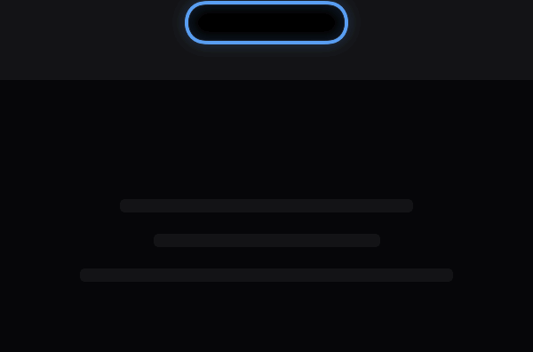
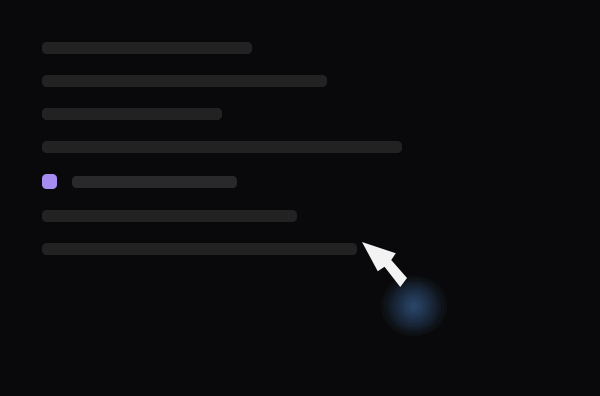
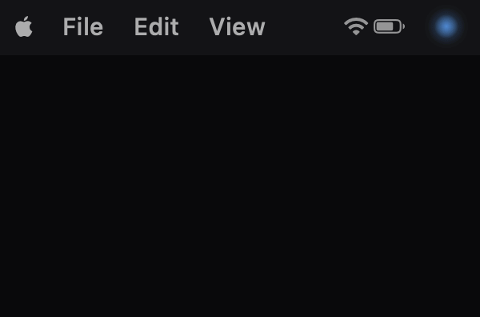

[简体中文](README.zh-CN.md)

# Liang

> Make your AI IDE's working state visible on your macOS screen.

Liang is a macOS menu bar app. Through a soft glow around the notch, a mouse-following glow orb, and a menu bar icon, it shows your AI IDE (Coding Agent)'s working state in real time — idle, processing, waiting for confirmation, success, or error. Without switching windows, you can tell at a glance whether the Agent is thinking, waiting for you, or done.

## Features

- **Notch glow**: automatically detects the notch and renders a non-intrusive state glow around it; falls back to a top-center glow on non-notch devices.
- **Cursor glow**: a mouse-following glow that changes color with state.
- **Menu bar status color**: the menu bar icon orb breathes/pulses with state, adapting to light/dark mode.
- **Multiple states**: `idle` / `processing` / `waiting` / `success` / `error` / `unknown` / `disconnected`, with customizable colors and animations.
- **Low disturbance**: respects macOS "Reduce Motion" and "Low Power Mode", automatically degrading to a static glow to save power and comply with system accessibility guidelines.

<table>
  <tr>
    <td align="center"> Notch glow</td>
    <td align="center"> Cursor glow</td>
    <td align="center"> Menu bar glow</td>
  </tr>
</table>

## Installation

1. Download the latest `Liang-x.y.z.dmg` from [Releases](https://github.com/fangshili/Liang/releases).
2. Open the DMG and drag `Liang.app` into Applications.

Requirements: macOS 14.0+, Apple Silicon (arm64).

## Usage

1. After launching Liang, a status orb icon appears in the menu bar.
2. On first launch, the onboarding flow guides you to configure Hooks bridging for Cursor, Claude Code, Codex, and CodeBuddy; you can also manage each IDE's connection in Settings at any time.
3. Once configured, when the Agent in the corresponding IDE starts working, waits for your confirmation, or finishes a task, the notch glow and menu bar icon change color accordingly.
4. Click the menu bar icon to view the current state, source, and most recent event; in Settings you can customize each state's color, glow toggle, brightness, blur, and animation speed.

## Privacy

Liang follows a "local-first, minimal collection" principle — it **does not read or upload your code, prompts, or file contents**.

- **State metadata only**: the bridge scripts extract only the minimal metadata fields needed for state (source, event type, timestamp, session/task ID, tool name, state, etc.) — **never** the prompt text, code content, or file contents.
- **Local-only data**: events are written to the local `~/.liang/` directory, event files are capped at 10 MB (truncated beyond that), and logs only record exceptions, not event payloads.
- **No telemetry, no cloud sync**: Liang collects no usage data, requires no account, and uploads nothing to any server.
- **Only network request**: the auto-update check (Sparkle) accesses the public update feed `appcast.xml` to detect new versions, carrying no user data.
- **Local config persistence**: all settings are stored in local `UserDefaults`, falling back to safe defaults if corrupted.

---

## Supported Coding Agents & Limitations

Liang senses state through each IDE's official Hooks mechanism, without injecting into or modifying your code. It currently supports 4 coding agents:

| Agent | Hooks location | Waiting (waiting) | Success/failure distinction |
|---|---|---|---|
| **Cursor** | `~/.cursor/hooks.json` | ✅ | ✅ |
| **Claude Code** | `~/.claude/settings.json` | ✅ | ✅ |
| **Codex** | `~/.codex/hooks.json` | ✅ | ❌ always success |
| **CodeBuddy** | `~/.codebuddy/settings.json` | ⚠️ CLI only | ❌ always success |

### Known limitations

**Client availability**
- **Codex**: the hook only runs after you trust it via `/hooks` in the CLI; the desktop app cannot trust it.
- **CodeBuddy**: the desktop app supports only 7 hook events; `waiting` (permission confirmation / deep thinking) is only observable in the CLI version.

**Success / failure distinction**
- **Codex, CodeBuddy**: the task-end event (`Stop`) carries no success/failure field, so it is always shown as "success".

**Event timing**
- **Codex**: the `SessionEnd` event fires only after ~30 minutes of session idleness.

**Version requirements**
- **Claude Code**: requires Claude Code ≥ v2.1.196 for the `prompt_id` field.

> ⚠️ **Claude Code and Codex have not yet been verified by the author**; actual behavior may differ from expectations — feedback is welcome.
>
> All the above limitations stem from each IDE's own Hooks spec, not from Liang.

---

If you have questions or suggestions, [open an issue](https://github.com/fangshili/Liang/issues) or [contact the author](mailto:fangshi.li.cn@gmail.com).
